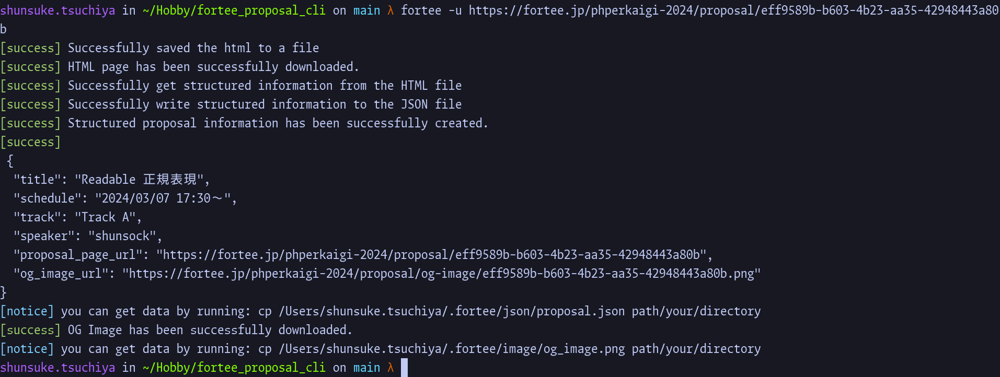
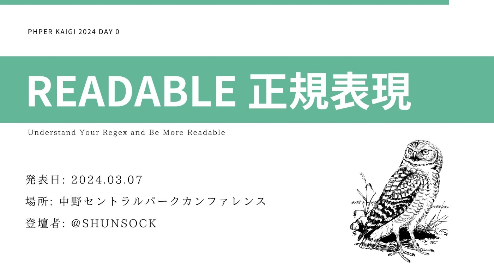

## About
- Name:
    - Full Name: Shunsuke Tsuchiya / 土屋 俊介
    - Nickname: Shunsock / しゅんそく
- Birthday: 2001-02-07
- Location: Tokyo, Japan
- Job:
    - Software Engineer / Web Developer
    - Worked at [PR TIMES](https://prtimes.co.jp/)
- SNS:
    - [Twitter](https://twitter.com/shunsock)
    - [GitHub](https://github.com/shunsock)
- Interests:
    - Webや機械学習などといった技術を通じてビジネスに貢献することに興味があります．
    - 思想として，ビジネスに貢献することが重要で，技術はその手段であるという考えを持っています．
        - そのため，特定の技術に固執せず，プロジェクトに最も貢献できる技術を採用したいと考える傾向にあります．
        - また，ビジネスに貢献するためにヒアリングの技術も重要だと考えています．
        - 上記の理由から，対面でのコミュニケーションに価値を見出しています．
        - 上記の理由から，触れたことのない技術でも必要であれば学習し，実用します
    - キャリアプランとしては，技術を通じてビジネスに貢献することができるエンジニアになることを目指しています．
        - その中でも特に，サーバーサイドの技術・インフラストラクチャの技術に重点を置いて学習しています．
- Others:
    - 技術コミュニティに参加することが好きです．
    - カンファレンスや勉強会によく参加しています．
## Career
### 略歴
- [PR TIMES (Software Engineer)](https://prtimes.co.jp/): 2023/04/01 - now
- [PR TIMES (Intern)](https://herp.careers/v1/prtimes/yqADIecHef7y): 2022/02/01 - 2023/03/31
- [Toyo University (Bachelier of Business, Department of  Marketing)](https://www.toyo.ac.jp/en/academics/faculty/fba/dmrk/): 2019/04/01 - 2023/03/31
- [Epson Avasys Corporation (Intern)](https://avasys.jp/blog/article/000221.html): 2021/08/23 - 2021/09/27

### PR TIMES
- When: 2023/04/01 - now
- As: Proper Software Engineer
- Summary:
    - PHPやPythonを持ちいて社内各所のシステム開発を行っています．
    - 2024年春には新規開発でPHPerKaigi 2024のブースゲームの開発を行いました．
    - 2023年秋から2024年春にかけては，PR TIMESの記事前処理サーバーの開発を行いました．
    - 2023年秋にはPR TIMESでは新規機能開発として，カテゴリーごとのランキングを実装しました．
    - 2023年夏には，新卒研修でPR TIMESの検索機能のPoCを開発・提案し，その後，検索機能のアルゴリズム開発に相談役として携わりました．

- Work:
    - title: PHPerKaigi 2024 Booth Game 「PHP 8.3秒チャレンジ」の開発 with PHP 8.3
    - period: 2024-01 => 2024-03
    - role: 計画者・実装者
    - about: PHPerKaigi 2024のブースゲーム「PHP 8.3秒チャレンジ」を開発しました．
    - languages:
        - `PHP`, `TypeScript`, `SQL (MySQL)`
    - framework:
        - `Leaf PHP`
        - `Pactum JS`
        - `React`
        - `Bun` + `Vite`
        - `Tailwind CSS`
    - Infrastructure:
        - `Nginx`
        - `MySQL`
        - `Docker`
        - `AWS (EC2)`
    - background:
        - PHPerKaigiは，PHPのカンファレンスであり，PHPの最新技術やトレンドを学ぶことができるイベントです．
        - 2024年には，PHPerKaigi 2024が開催されることになりました．
        - PR TIMESでは核であるprtimes.jpにおいて，PHPを使用しているため，PHPerKaigiには積極的にスポンサーとして参加しています．
        - スポンサーには企業ブースという企業専用のブースが割り当てられ，広告や宣伝をすることができます．
    - issue:
        - 前回のイベント(PHP Conference 2023)ではスポンサーブースでPHPに関するクイズを提供しましたが，以下のような問題がありました．
            - 問題自体の難易度調整が難しい．
            - X(Twitter)への反応があまりなかった．
            - ブースに常時エンジニアが在籍する必要がある．
            - １回の体験に時間がかかってしまう．
        - そこで案をチームで出し合い以下のような内容にすることが決まりました．
            - PHPのlatest version 8.3にちなんだ10秒ストップチャレンジゲーム．
            - Result画面でQRを出すことによってTwitterでシェアをしてもらう．
    - assignment:
        - 案をWeb Applicationとして実現することになりました．
    - limitation:
        - 私ももう一人の開発者も普段の仕事をしながら実装する必要があるので，短期間での開発が求められました．　
        - また，当日は普段の社用PCではなくイベント専用のPCで行うためデプロイの必要がありインフラを整備する必要がありました
        - しかし，インフラは数日しか使わないものであるため，簡単に片付けられる最小構成が求められていました．
    - technology selection:
        - Common: イベントなので変わり種を入れようと話していました
        - Frontend: 高機能ですぐに開発ができるReactを使用しました．一工夫としてPackage ManagerにBunを使用しました．
        - Backend: PHPのイベントなのでPHP 8.3を使用しました．一工夫としてLeaf PHPを使用しました．
        - Database: PHPと相性の良いMySQLを使用しました．
        - Infrastructure: AWSでの最小構成を考え，EC2 on Dockerを使用しました．
    - development:
        - BackendとInfrastructureの計画を担当しました
        - 私は API Serverの構築，FrontendのInfrastructure層(=Repository層)の実装を担当しました．
        - もう一人の開発者はFrontendを中心に実装を担当しました．
    - test play:
        - ある程度できた時点で社内でテストプレイを行いました．
    - result:
        - PHP 8.3秒チャレンジを開発することで，PHPerKaigi 2024のブースゲームを実現しました．
        - 3日間に及ぶPHPerKaigi2024本番では、140人以上の方に「PHP8.3秒チャレンジ」にプレイしていただきました。
        - 非常に好評で[Twitterで多くの投稿をもらった](https://twitter.com/search?q=%23prtimes_dev%20until:2024-03-10%20since:2024-03-06&src=typed_query&f=live)他，カンファレンスのフィードバックでもアイディアや実装が評価されました．
        - 総合的にみて，issueを解決することできたと考えています．
    - learn:
        - 今回の開発ではコンセプトを大事にしました．PHP 8.3を目指すという前向きな目標を掲げたことにより，参加しやすい雰囲気を作ることができました．
        - 最小構成での開発を行ったことで，インフラの構築や開発の効率化について学びました．単に簡素にすることと，最小構成にすることは異なることを学びました．
        - 顧客と接点を持つことの重要さを学びました．
            - 普段ではなかなか直接顧客と接点を持つことはないですが，今回の開発では直接顧客と接点を持ちフィードバックを得ることができました．
            - 顧客が感じていることと，自分たちが感じていることに差異があることを学びました．
        - チーム開発の重要性を学びました．
            - 今回の開発では，自分ともう一人の開発者で多くの機能を作る必要があったのでコミュニケーションの機会を通常より多く取りました．
            - 事前に決めておいても，実際に開発を進めると変更が必要になることが多かったので，上記の選択は正解でした．
    - reference:
        - [PR TIMES 開発者ブログ."PHPerKaigi2024のブース企画を担当しました！"](https://developers.prtimes.jp/2024/04/03/phperkaigi2024-booth/)

- Work:
    - Batch Server 開発
    - title: PR TIMESの記事データの前処理バッチサーバーの開発
    - period: 2024-09 => 2024-03
    - role: 計画者・実装者
    - about: PR TIMESの記事データの前処理バッチサーバーを開発しました．
    - languages:
        - `Python`, `SQL (PostgreSQL, BigQuery)`
    - framework:
        - `Prefect`
    - Infrastructure:
        - `BigQuery`
        - `Cloud Storage`
        - `Cloud Compute Engine`
        - `IAP`
        - `Poetry`
    - background:
        - PR TIMESの記事データは，プレスリリースのデータを含む膨大なデータ量があります．
        - PR TIMESの記事は公共性が高く，日本語の文法に則っているため，機械学習の学習データとして適していると考えられました．
        - それらの価値はインターン時代に社内で紹介しています ※ PR TIMES(Intern)の項目を参照
    - issue:
        - 一方で，これらを機械学習に用いるためにはデータの前処理が必要でした．
        - PR TIMESのデータはHTML形式であり，HTMLタグや文字参照の除去や形態素解析(Tokenization)が必要でした．
        - これらの処理は自然言語や日本語のテキストデータに関する専門知識を必要とします．
        - 現状では社内でのデータ活用を進めにくいのでDWHを使って前処理済みのデータを配信することになりました．　
    - assignment:
        - これらの前処理を行うバッチサーバーを開発することになりました．
    - system description:
        - バッチサーバーは，Cloud Compute Engine上で動作し，BigQueryからデータを取得し，前処理を行い，Cloud StorageとBigQueryに保存することができます．
        - バッチサーバーは，定期的に動作するように設定されており，前処理済みのデータをCloud Storageに保存します．
        - また，バッチサーバーは，IAPを用いて外部からのアクセスを制限しています．
    - technology selection:
        - Python: データ処理のライブラリが豊富であり，自然言語処理のライブラリも充実しているため，Pythonを選定しました．
        - Prefect: Pythonのバージョンに制限がなかったのでApache Airflowに比べてUIや機能が優秀なPrefectを選定しました．
        - BigQuery: PR TIMESはDWHとして全社のデータをBigQueryに保存しているため，BigQueryを用いてデータの取得を行いました．
        - Cloud Storage: BigQueryとの相性の良さから，Cloud Storageを用いてデータの保存を行いました．
        - Cloud Compute Engine: BigQueryとの相性の良さから，Cloud Compute Engineを用いてバッチサーバーを構築しました．
        - IAP: バッチサーバーへのアクセスを制限するためにIAPを使用しました．
    - development:
        - アドバイスをもらいながら，私がオペレータとして開発しました
    - result:
        - バッチサーバーを開発することで，PR TIMESの記事データを前処理済みのデータとして取得できるようになりました．
    - learn:
        - この開発では，機能の実装はできたものの悔しい点がいくつかありました．
        - PoCを作らずにいきなり実装してしまったため，後からアーキテクチャの変更が必要になりました．
            - このことから，まず実現可能性を最小構成で確認することの重要性を学びました．
        - プロジェクト管理の重要性を学びました．
            - 今回の開発では，自分がオペレータとして開発を行いましたが，プロジェクト管理を適切行う人がいなかったため，進捗管理が難しかったです．
            - 進捗管理が難しかったため，開発が遅れることがありました．

- Work:
    - PR TIMES の新規機能開発
    - title: PR TIMESのカテゴリーランキング実装
    - period: 2023-09 => 2023-11
    - role: 実装者
    - about: PR TIMESの新規機能として，カテゴリーごとのランキングを実装しました．
    - languages:
        - `PHP`, `JavaScript`, `SQL (PostgreSQL)`, `Opensearch`
    - framework:
        - `Smarty (PHP Template)`
    - background:
        - PR TIMESは，プレスリリースの配信サービスを提供している企業です．
        - 既存の機能として総合的なランキングがありました．
            - ランキングはプレスリリースを配信する団体のモチベーションや広告のきっかけにもつながるので，重要な機能でした．
            - 顧客から良いフィードバックをもらっており人気がありました
    - issue:
        - 既存のランキングは総合的なランキングであり，ニッチな分野が掲載される機会が少ないという問題がありました．
        - カテゴリーごとのランキングを実装することで普段見られないようなプレスリリースにも目が行くようになると考えられました．
    - assignment:
        - 既存のランキングの機能を拡張し，カテゴリーごとのランキングを実装することになりました．
    - technology selection:
        - 本件は関わっていません
    - development:
        - 私ともう一人の開発者で実装しました．
        - 私はFrontend / Backend (Controllerからサービス層)を担当しました．
        - もう一人の開発者はBackend (Repository層) / OpenSearchの設定を担当しました．
        - PHP部分が複雑で理解が難しかったですが，Debug ToolやPHP Stormの機能を使いながら理解を深めました．
    - result:
        - カテゴリーごとのランキングを実装することで，ニッチな分野のプレスリリースにもアクセスがしやすくなりました．
    - learn:
        - Layered Architectureの理解
            - PR TIMESのリファクタリングが進んでいる部分はLayered Architectureに基づいていました．
            - これにより，OpensearchのAPIを意識せずに，ControllerからService層を経由してRepository層にアクセスすることができました．
            - そのおかげで実装が楽になると気づき，学びになりました．
        - 一見謎なコードでも意外に理由があることを学びました．
            - 例えば，Smartyのテンプレートエンジンでコメントアウトしたところバグが起こりました
            - これはコメントアウトをカスタムをしているからですが，昔はシンタックスハイライトが弱かったという背景があることを知りました．

- Work:
    - title: 検索機能改善PoC作成 (検索機能アルゴリズム開発)
    - period: 2023-04 => 2023-05 (2023-06 => 2023-09)
    - role: PoC開発者 => 技術相談役・技術調査役
    - about: PR TIMESの検索機能のPoCを開発・提案し，その後，検索機能のアルゴリズム開発に相談役として携わりました．
    - technologies:
        - PoC: `Python`, `TF-IDF`
        - Production: `Opensearch`, `AWS`
    - background:
        - 2021年に開発体制が現体制になりましたが，当初はサービスがいつ止まってもおかしくない状況でした．
        - 当時のElasticSearchは自前で運用していましたが，壊れかけで2022年に移行されました．
        - 2023年になり，ある程度Webサービスとしての安定感が出てきたため，検索機能の改善に取り組むことになりました．
    - issue:
        - 2023年当初，PR TIMESの検索機能はOpensearchで運用されていましたが検索としての機能をなしていませんでした．
        - 顧客から「何が出現するかわからないから逆に使っている」というようなフィードバックをもらっていたそうです．
    - assignment:
        - 総合職と合同の新卒研修の一貫として，プロダクトの検索機能の改善案を考え，発表することになりました．
        - チームの知識役として総合職のメンバー・開発職のメンバーと協力し，検索機能のアルゴリズムの提案を行いました．
    - proposal:
        - 不要な部分の除去
            - 現状では検索対象の記事の本文全てをindexに含めていましたが，記事の後半部分には会社の住所など不要なデータが含まれていることに気づきました．
            - そこで，記事の前半部分のみをindexに含めることを提案しました．
            - また，正規化についても改善できることに気づきました．
            - HTMLをそのまま，indexに含めていたたので形態素解析(Tokenize)に影響があると推察できたからです．
            - そこで，HTMLタグを除去や文字参照の除去といった文字列正規化を提案しました．
        - 必要な部分の追加
            - また，タイトルやサブタイトルもindexに含めることで，検索結果の精度を向上させることができました
        - アルゴリズムの改良
            - 現状は単純なAND/OR検索でしたが，TF-IDFベースScoring Functionを用いる検索アルゴリズムを提案しました．
            - 提案手法のLucine's Practical Scoring FunctionはQueryのTokenごとに重みを計算し，それを元に検索結果をランク付けすることができます．
            - よって重要な単語が含まれている記事が上位に表示されるようになりました．
    - PoC:
        - About: 課題そのものは上記の提案で十分でしたが，自分達の案を採用することで改善することを認知してもらうためにdemoを作成しました．
        - background: チームメンバーがプレゼンを作っているタイミングで手が空いたので，チームメンバーに許可をとって開発しました
        - developer: 自分
        - languages: `Python`
        - FW: なし
        - algorithm: `TF-IDF`, `Lucine's Practical Scoring Function`
        - technology selection:
            - NLPと相性がよく，予めNLP向けの関数が用意されているため，`Python`を選定しました．
            - TF-IDFまではMeCab Pythonやsklearnを用いて実装しましたが，Lucine's Practical Scoring Functionは用意されていないので自前で実装しました．
            - 実装の詳細はReferenceのLinkを参照してください．
        - result：
            - PoCを通して，提案手法の有効性を認知してもらうことができました．その後，提案手法の一部が採用され，検索機能の改善が行われました．
            - また，検索技術・自然言語処理の知識が認められ，技術相談役・技術調査役としてその後の改善に携わることができました．
    - Production:
        - About: PoCを通して提案手法の有効性を認知してもらい，その後，提案手法の一部が採用され，検索機能の改善が行われました．
        - developer: 開発チーム
        - role: 技術相談役・技術調査役
        - languages: `PHP`, `TF-IDF`
        - framework: `Opensearch`
        - technology selection:
            - 他の業務と並行して短い期間で開発する必要があったため，既存の技術を用いつつ改善をすることになりました．
            - 日本語形態素解析機がOpenSearchは`kuromoji`のみの対応であるため`MeCab`ではなく`kuromoji`の対応となりました．
            - Lucine's Practical Scoring Functionは実装の時間の関係でTF-IDFのみの採用となりました．
        - result： 検索機能の改善により，検索結果の精度が向上しました．短い期間でしたが，十分な成果をあげることができました．
    - Others:
        - これらの開発を通して，検索機能の内部を学びました．その経験を活かし，2024年にはPHPカンファレンス福岡で検索機能のアルゴリズムについてのセッションを行う予定です．
        - [CfP: 作って学ぶ ★ 検索機能](https://fortee.jp/phpcon-fukuoka-2024/proposal/356e0c9c-fbc3-4c88-bb89-0ba3a03672bd)
    - Reference:
        - [GitBook."Elastic Search - Definitive Guide"](https://feliperohdee.gitbooks.io/elastic-search-definitive-guide/content/170_Relevance/15_Practical_scoring.html)
        - [Medium."Deconstructing Scoring In Elasticsearch"](https://codeburst.io/deconstructing-scoring-in-elasticsearch-e8544676a24)

### PR TIMES (Intern)
- When: 2022/02/01 - 2023/03/31
- As: Intern
- Works:
    - 機械学習を用いたPoCの開発
    - Description:
        - 2022年には，機械学習を用いたPoCの開発を行いました．
            - 具体的には，Word2Vecを用いた類似度に基づく単語推薦システムをPoCとして開発し，社内に公開しました．
            - この開発を通して，文字コードの知識を深く学びました
            - 特に日本語の新旧字体の処理を行う必要があり，互換表を作成するなどの作業を行っています．
            - [新旧字体の表記ゆれを統一するために互換表を作成した話](https://developers.prtimes.jp/2022/11/18/change_word_form/)
    - languages:
        - `Python`
        - `JavaScript`
    - frameworks:
        - Python: `Gensim`, `MeCab`, `FastAPI`
        - JavaScript: `Next.js`
    - algorithms:
        - `Word2Vec`
    - infrastructure: `AWS` / `GCP`
    - background:
        - PR TIMESは，プレスリリースの配信サービスを提供している企業です．
        - PR TIMESの記事データは，プレスリリースのデータを含む膨大なデータ量があります．
        - PR TIMESの記事は公共性が高く，日本語の文法に則っているため，機械学習の学習データとして適していると考えられました．
    - issue:
        - 一方でそのデータの価値はあまり理解されていませんでした．
        - そのため，機械学習を用いたPoCの開発を行い，データの価値を認知してもらうことが求められました．
    - technology selection:
        - インターン生のPoCであるため特に言語やアルゴリズムに制約はありませんでした
        - ただし，社内のシステムはAWSで運用されているため，AWSを用いた開発を行いました．
        - よって管理のしやすさから以下の方法にしました
            - FrontendとAPI Server, 機械学習環境を分けることでコードを疎結合になるようにしたい
            - Smart UIを避けるため，FrontendとBackendの切り離しをしました．
            - Backendの機械学習推論サーバーは機械学習モデルがPythonであることから，Pythonの軽量FWのFastAPIを選定しました．
            - 機械学習は完全にローカルサーバーで行い，API Serverは推論のみを行うようにしました．
    - development:
        - 自分で全て開発を行いました．
        - また，成果物を社内に公開し，フィードバックをもらいながら改善を行いました．(社長からのフィードバックもありました)
        - その関係でDocumentの整備も並行して行いました．
    - result:
        - 機械学習を用いたPoCの開発を行うことで，PR TIMESの記事データの価値を認知してもらうことができました．
        - インフラストラクチャの構築やデータの前処理など，機械学習の理論には出てこないものの実践で重要なスキルを学ぶことができました．
        - ビジネス側からの意見をもらったことで，技術だけでなくビジネスの視点も学ぶことができました．

### Toyo University
- When: 2019/04/01 - 2023/03/31
- As: Student of Bachelier of Business, Department of  Marketing
- TimeLine:
    - 2019年4月1日，東洋大学経営学部に入学
    - 2020年4月1日，大久保ゼミに参加
    - 2023年3月31日，東洋大学経営学部マーケティング学科卒業
- Description:
    - 東洋大学では，経営学部に所属しマーケティングを専攻しました．
    - 東洋大学のマーケティング学科では統計とRの授業が必須であり，これをきっかけにデータ分析やプログラミングに興味を持ちました
    - 2020年には，大久保ゼミに参加し，大久保ゼミでは多変量解析，テキスト解析を学びました
- Others:
    - 大学では専門性を高めることを目標にしていました
        - その中で統計やプログラミングに興味を持ち，重点的に勉強をしていました
    - 課外では，専門知識を深めるために，統計検定に挑戦しました
        - 大学2年生で2級に合格し，大学3年生で準1級に合格しました
        - 準一級は学部初でした

### Epson Avasys Corporation (Intern)
- When: 2021/08/23 - 2021/09/27
- As: Intern (Summer Internship)
- Description:
    - Epson AvasysというEpsonグループのシステム開発を行う会社で，夏季インターンシップに参加しました．
    - 前半にOpenCVを用いた画像処理のワーク後半にチームでEpson Avasys Corporationで社内Wikiの推薦システムの開発を行いました．
    - 特に後半では，ルールベースや協調フィルタリングを用いた推薦システムの技術を学びました
    - 日付情報やカテゴリ情報，ユーザー情報を用いた推薦システムの開発を行いました．
    - 単なる推薦システムではなく，Doc2VecやClusteringといったNLPの技術をふんだんに使った面白い推薦システムになりました
- Works:
    - title: 社内Wikiの推薦システムの開発
    - period: 2021-08
    - role: 企画者・実装者
    - languages: `Python`
    - algorithms:
        - `Clustering` => `K-means`
        - `Neural Network` => `Doc2Vec`
        - `Recommendation System`
            - `Rule-based`
            - `Collaborative Filtering (強調フィルタリング)`
    - frameworks:
        - `scikit-learn`
        - `Gensim`
    - background:
        - Epson Avasys Corporationでは，社内Wikiを利用しています．
        - 社内Wikiは，社員が情報を共有するためのプラットフォームであり，情報の量が膨大であるため，情報の検索が困難でした．
        - そのため，社内Wikiの情報を活用するための推薦システムの開発が求められました．
        - インターンではその叩き台となるPoCの開発を行いました．
    - issue:
        - 社内Wikiの情報が膨大であるため，情報の検索が困難でした．
    - proposal:
        - 強調フィルタリングとコンテンツベースフィルタリングを組み合わせた推薦システムを提案しました．
    - development:
        - インターン生4人でチームを組み，推薦システムのPoCを開発しました．
        - 私はコンテンツベースの推薦部分を担当しました．
        - 最初は記事情報全体を使うことが良いと考えていましたが，実験を繰り返すうちに，自分たちがタイトルやカテゴリ情報でクリックするか判断していることに気づきました．
        - そのため，タイトルやカテゴリ情報のみに情報を絞り，機械学習モデルを構築しました.
        - アルゴリズムそのものも当初は，word2vec+k-meansでしたが，調査と実験により，Doc2Vecが適していることがわかりました．
        - アルゴリズムのテストとして推薦システムの出力のカテゴリの分布を出力するようにしました．
        - 最終日の発表では，チームで開発した推薦システムのPoCを発表しました．
    - technology selection:
        - 今回はPythonとNotebookで作るという前提がありました．
        - アルゴリズムはコンテンツベースのみで実験を回して，Doc2Vecに落ち着きました．
    - result:
        - 推薦システムのPoCを開発することで，社内Wikiの情報を活用するためのPoC作り発表することができました．
        - テストを行っていた部分が特に評価されました．
    - learn:
        - GitLabを使ったチーム開発の基礎を学びました．
        - 初めてのチーム開発を通じて，チームメンバーと話し合うことで開発者としての能力がスケールすることを学びました．
        - 定量的なテストの重要性を学びました．テストを行うことで客観的に自分たちのアルゴリズムの評価ができることを学びました．
        - 大量のデータに対してアルゴリズムを適用する際に時間がかかることを学び，効率的なアルゴリズムの開発が重要であることを学びました．
    - reference:
        - [Epson Avasys Corporation."夏季インターンシップ　実施報告【集合形式】"](https://avasys.jp/blog/article/000221.html)
## Technology Stack
- 以下は使用経験のある技術であり，初見の技術でもDocumentやソースコードがあれば理解し，使用することができます.
- 特に知識の持っている技術については⭐️をつけています.
- PHPについては，8系と7系，5系でほぼ別の言語であるため，括弧でバージョンを記載しています.

### Language
- 動的型付け言語
    - Python ⭐️
    - R Language
    - PHP (8.0 >) ⭐️
    - JavaScript (Node.js, Vanilla)
    - Shell Script (bash, zsh)
- 静的型付け言語
    - TypeScript
    - Java
    - C / C++
    - C# ⭐️
    - Go
    - Rust

### Cloud Service
- AWS ⭐️
- GCP

### Database
- MySQL
- PostgreSQL
- SQLite
- BigQuery ⭐️
## Awards and Certificates
Web x MLの領域で活動をしています．その活動の中で受賞や資格を取得したものをまとめです．

### YAPC::Kyoto 2023: The Best LT
- URL: [YAPC::Kyoto 2023](https://yapcjapan.org/2023kyoto/)
- Date: 2023-03-20
- Description: ["ChatGPTと文字コード"](https://www.canva.com/design/DAFddEPFvZI/Z7qh-Y9Ju3wisr95wEzpIg/view?utm_content=DAFddEPFvZI&utm_campaign=designshare&utm_medium=link&utm_source=publishsharelink)というテーマで発表をしました．
- Related Articles:
    - 本発表を受けてLogmi Tech様より2本の記事の掲載とYoutube登壇のオファーをいただきました．
    - [ChatGPTは文字コードをどのように解釈しているか Unicodeの「日本語認識」「括弧の抽出」「旧字体と新字体の変換」を実験してみた](https://logmi.jp/tech/articles/328614)
    - [ChatGPTを使って、文字コードの理解と記述の負担を軽減できるのか「日本語と認識しているUnicodeの範囲」「括弧の検出」「新字体への変換」を調査してみた](https://logmi.jp/tech/articles/329484)
    - [「生成AIを使ってこんなもの作ってみました」 開発者LT大会](https://logmi.jp/events/4013)

### 統計検定準一級 (Japan Statistical society Certificate: Grade Pre-1)
- URL: [統計検定](https://www.toukei-kentei.jp/)
- Date: 2021-11
- Technical Skills: `Statistics`, `Mathematics`
- Description: 統計検定の準一級をB3の秋に取得しました．単に就活で有利にするだけであれば2級で十分なのですが，文系出身ながら統計学の専門的知識があること・大学数学レベルの知識があることを証明するために取得しました．ちなみに学部初の取得だったそうで学部で紹介されることがありました．

### PR TIMES HACKATHON: The Individual Award
- URL: [PR TIMES HACKATHON](https://www.wantedly.com/projects/796082)
- Date: 2021-12-24
- Technical Skills: `Python`, `JavaScript`, `Natural Language Processing`, `K-means`, `TF-IDF
- Description: PR TIMESのハッカソンで個人賞をいただきました．お題はPR TIMESに新機能をつけてを改善せよという題で，私は自然言語処理を用いた，PR TIMES TVの記事推薦機能をPythonのAPIとそのClientをJavaScriptで作成しました．
- How to create AI:
    - まず，PR TIMES TVの記事を提供されたAPIから取得し，ビデオのタイトルをBoW化してベクトル化しました．
    - 次に特徴量を抽出するために，TF-IDFを適用しました．
    - その後ベクトルをKmeansでクラスタリングするModelを作成します．
    - 最後に，そのクラスタリング結果を元に，ユーザーに記事を推薦する機能を作成しました．
    - テストとして, 記事についているラベルを表示するようにしました．実際に推薦するタイトルとラベルを表示することで納得してもらうことができました．
## Presentation
Web技術やプログラミングのほかにも，データ分析や自然言語処理についても発表を行っています．

### ChatGPTと文字コード
- URL: [shunsock."ChatGPTと文字コード".2023 Mar 20th.YAPC::Kyoto 2023](https://www.canva.com/design/DAFddEPFvZI/Z7qh-Y9Ju3wisr95wEzpIg/view?utm_content=DAFddEPFvZI&utm_campaign=designshare&utm_medium=link&utm_source=publishsharelink)
- Location: YAPC::Kyoto 2023
- Theme: `Character Code`, `ChatGPT`, `NLP`, `Unicode`
- Description:
当時登場から数ヶ月経ったChat GPTに関する発表です．単なる使ってみたという内容ではなく，ChatGPTが文字コードをどのように解釈しているのかというニッチなテーマで発表しました．当時ChatGPTに関する発表は沢山ありましたが，文字コードについて分析していたのは私ぐらいだったからか聴衆の興味を集めました．光栄なことに，この発表はYAPC::Kyoto 2023でBest LTを受賞しました．また，Logmi Techさんにて記事が掲載されました．

関連記事
- [ChatGPTは文字コードをどのように解釈しているか Unicodeの「日本語認識」「括弧の抽出」「旧字体と新字体の変換」を実験してみた](https://logmi.jp/tech/articles/328614)
- [ChatGPTを使って、文字コードの理解と記述の負担を軽減できるのか「日本語と認識しているUnicodeの範囲」「括弧の検出」「新字体への変換」を調査してみた](https://logmi.jp/tech/articles/329484)

### 嗚呼我が愛しきインタープリタ
- URL: [shunsock."嗚呼我が愛しきインタープリタ".2023 Oct 8th.PHP Conference Japan Tokyo](https://www.canva.com/design/DAFv6xqcGHs/mDbIDvwvA5Zv4w9bkHh3_g/view?utm_content=DAFv6xqcGHs&utm_campaign=designshare&utm_medium=link&utm_source=publishsharelink)
- Location: PHP Conference Japan 2023
- Theme: `PHP`, `Interpreter`, `Bytecode`
- Description:
PHPの中級者に向けたインタープリタの発表です．PHPの"Hello World"がどのようにして動くのか，アプリケーションから一歩踏み込んで理解するための発表です．
この発表は初めてのPHP Conferenceの登壇でした．著者はこの発表をきっかけにPHPのコミュニティに関わっていくことになります．

### プロポーザルに通したいのでプロポーザルのテキスト分析をします！
- URL: [shunsock."プロポーザルに通したいのでプロポーザルのテキスト分析をします！".2024 Jan 13th.PHP Conference Hokkaido](https://www.canva.com/design/DAF4_2c-lm8/TboQfc5BrhE94p3CiK9joA/view)
- Location: PHP Conference Hokkaido 2024
- Theme: `Scraping`, `Data Cleaning`, `Data Analysis`, `Text Analysis`, `GPT4`
- Description:
よくあるデータ分析の発表です．ですが，公開されているデータセットが存在しないので自分で作るところから始めるというアプローチを取りました．そのため，データ分析そのものだけではなく，良いデータの集めかたや，データの前処理についても触れています．

### Readable 正規表現
- URL: [shunsock."Readable 正規表現".2024 Mar 7th.PHPerKaigi 2024](https://www.canva.com/design/DAF9IPmoHMM/Y40JL-jOOGwSE89vT9mytg/view)
- Location: PHPerKaigi 2024
- Theme: `Regular Expression`, `Readability`, `PHP 8.x`, `Solid Principle`
- Description:
正規表現はシンプルで汎用的なツールですが，多くのプログラマは複雑で読みにくいと考えています．なぜ，正規表現が複雑化するのか，その対処方法について話しました．
この発表ではサンプルコードとスライド両方を参照できるように設計しています．幸いなことに，特に評価が高く多くのフィードバックをいただいた他，プログラムの可読性について沢山の方と議論するきっかけになりました．
なお，サンプルコードはPHP 8.2 >= で動作します．

サンプルコード
[Smaple Code: GitHub "phper_kaigi_2024"](https://github.com/shunsock/phper_kaigi_2024)

関連記事
[Readable 正規表現 Web Article版](https://zenn.dev/shundeveloper/articles/e6405c323c555a)
## Portfolio
ここでは個人での制作物を紹介します，

### Fortee Proposal CLI

- GitHub: [Fortee Proposal CLI](https://github.com/shunsock/fortee_proposal_cli)
- Technology:
    - Language:
        - `Rust`
        - `Shell Script`
    - Dependency
        - `Makefile`
- Description:
    - Forteeに投稿されたプロポーザルデータをダウンロード+表示するためのコマンドラインツールです
    - URLを指定すると，プロポーザルデータとOG Imageをダウンロードします
    - ダウンロードしたデータは，Command Line上で表示されます
    - このツールを使うことで，登壇ブログを書く作業を効率化できます

### Readable Regex

- GitHub: [Readable Regex](https://github.com/shunsock/phper_kaigi_2024)
- Zenn: [Readable Regex](https://zenn.dev/shundeveloper/articles/e6405c323c555a)
- Technology:
    - `Regular Expression`
    - Language:
        - `PHP (8.2 >=)`
- Description:
    - 中野セントラルパークカンファレンスで行われたPHPerKaigi 2024で「Readable 正規表現」というタイトルでトークさせていただきました
    - その際に使用したコード・スライドを公開しています

### Resume
- GitHub: [Resume](https://github.com/shunsock/resume)
- Technology:
    - Language:
        - `Python`
        - `Shell Script`
    - Infrastructure
        - `Docker`
        - `Poetry` (Python Dependency Management)
        - `GitHub Actions` (CI)
    - Dependency
        - `Makefile`
- Description:
    - 自分の履歴書を生成するためのツールです
    - `Python`で書かれており，`Docker`を使って環境を構築します
    - Pythonを使うことによってzennやHatena Blogの記事を自動で取得し，履歴書に反映させることができます

### Dotfiles
- GitHub:
    - [my_zsh_config](https://github.com/shunsock/my_zsh_config)
    - [my_vim_config (Pure Vim)](https://github.com/shunsock/easy_start_vim)
    - [my_nvim_config (NeoVim)](https://github.com/shunsock/my_nvim)

### Playgrounds
- GitHub:
    - [Dotnet Playground (C#)](https://github.com/shunsock/dotnet_playground)
    - [Rust Playground](https://github.com/shunsock/rust_playground)
    - [Dagster Playground (Python & Rust)](https://github.com/shunsock/dagster_playground)
    - [Python Playground](https://github.com/shunsock/python_playground)
## Tech Blog
| Site Name | Title       |
| ------    | -----------|
|hatena_blog|[若手・学生サーバーサイドエンジニアLT会で登壇した話](https://shundeveloper.hatenablog.com/entry/20240120)
|hatena_blog|[初心者向け 登壇するためのTips](https://shundeveloper.hatenablog.com/entry/2023_advent)
|hatena_blog|[入社エントリ: PR TIMES](https://shundeveloper.hatenablog.com/entry/entry_prtimes)
|hatena_blog|[もみじ饅頭は揚げたてがうまい](https://shundeveloper.hatenablog.com/entry/2024/02/13/010756)
|hatena_blog|[YAPC::Kyoto 2023 ベストLT賞をいただいた話](https://shundeveloper.hatenablog.com/entry/2023/03/21/135437)
|hatena_blog|[PHPerKaigiに参加してきました](https://shundeveloper.hatenablog.com/entry/phperkaigi_2023)
|hatena_blog|[PHP Conference Japan 2023に参加してきました](https://shundeveloper.hatenablog.com/entry/2023/10/08/180751)
|hatena_blog|[Object Oriented Conferenceに参加しました！](https://shundeveloper.hatenablog.com/entry/ooc_2024)
|hatena_blog|[ISUCON夏祭りに参加しました！！](https://shundeveloper.hatenablog.com/entry/isucon_summer_fes_2023)
|hatena_blog|[Fastly Yamagoya 2023に参加しました！](https://shundeveloper.hatenablog.com/entry/fastly_yamagoya2023)
|hatena_blog|[ [Ya8参戦記] 終電は家の近くまで行ければセーフ【西武線に気をつけろ】](https://shundeveloper.hatenablog.com/entry/ya8_2024)
|zenn|[確率母関数と積率母関数](https://zenn.dev/shundeveloper/articles/ed692f0b8677da/)
|zenn|[独立ではない確率変数列の和の分散 (変数の数がnの場合)](https://zenn.dev/shundeveloper/articles/398cb39026a4f3)
|zenn|[正規表現と友達になろう](https://zenn.dev/shundeveloper/articles/8587cedf949a4c)
|zenn|[日本語に関連する主なUnicodeの範囲と公式のpdfの一覧](https://zenn.dev/shundeveloper/articles/a4be0379508e2d)
|zenn|[日本語に関連するunicodeの範囲一文字を指定する正規表現マッチオブジェクトを作成する関数の作成](https://zenn.dev/shundeveloper/articles/b5cc85b4d1e7eb)
|zenn|[平均と分散を漸化式を使って爆速で求める](https://zenn.dev/shundeveloper/articles/a38d310f5e524e)
|zenn|[友達のMacの環境構築をした話 (初心者向け)](https://zenn.dev/shundeveloper/articles/a2c360bc89ad52)
|zenn|[初心者がRustのstd::netのソースコードを読んでみた](https://zenn.dev/shundeveloper/articles/9b45b1a886961a)
|zenn|[マルコフ連鎖モンテカルロを用いたベイズ推定](https://zenn.dev/shundeveloper/articles/8be490a0327cb1)
|zenn|[【統計学】メトロポリス-ヘイスティング法(Metropolis-Hastings Algorithm)で詳細釣り合い条件が成立することの証明](https://zenn.dev/shundeveloper/articles/878f2b6504338e)
|zenn|[[統計学]モンテカルロ積分の証明と実践](https://zenn.dev/shundeveloper/articles/c51a759af9b5ca)
|zenn|[[統計学] 畳み込み積分と確率変数の和 を読みました](https://zenn.dev/shundeveloper/articles/871ed8111e61ef/)
|zenn|[[統計学] 現代数理統計学の基礎: 7章 式変形の導出](https://zenn.dev/shundeveloper/articles/4acdc8ca2944ae/)
|zenn|[[統計学] 正規分布の期待値・分散を素早く導出する方法, 標準正規分布の導出と期待値・分散](https://zenn.dev/shundeveloper/articles/c0ac306c89f996)
|zenn|[[統計学] 正規分布の期待値と分散(1次元)](https://zenn.dev/shundeveloper/articles/a3bb9d8634ca19/)
|zenn|[[統計学] 数理統計学の主要な概念の定義一覧](https://zenn.dev/shundeveloper/articles/6b071255a1546c)
|zenn|[[統計学] 二項分布の正規近似 De Moivre-Laplace theorem](https://zenn.dev/shundeveloper/articles/4b331a06ca88c0/)
|zenn|[[統計学] 二項分布の期待値と分散, 積率母関数, 最尤推定, 可視化](https://zenn.dev/shundeveloper/articles/e8c1049ca540db/)
|zenn|[[統計学] 二項分布のベイズ推定](https://zenn.dev/shundeveloper/articles/986899a7a29e2d/)
|zenn|[[統計学] ポアソン分布の期待値, 分散, 積率母関数, 最尤推定, 可視化](https://zenn.dev/shundeveloper/articles/ecfea8a4a01309/)
|zenn|[[統計学] ポアソンの小数法則の証明と可視化](https://zenn.dev/shundeveloper/articles/77f3739af0214b/)
|zenn|[[統計学] ポアソンの小数法則の証明と可視化](https://zenn.dev/shundeveloper/articles/77f3739af0214b)
|zenn|[[統計学] ベータ分布の期待値と分散](https://zenn.dev/shundeveloper/articles/b5b4002bc09f3b/)
|zenn|[[統計学] ベルヌーイ分布の期待値と分散, 積率母関数, ベイズ推定](https://zenn.dev/shundeveloper/articles/100ba5ebfc19cb/)
|zenn|[[統計学] ガンマ分布の期待値・分散, 積率母関数, 可視化](https://zenn.dev/shundeveloper/articles/eba111782c85cf/)
|zenn|[[統計学] カテゴリ分布の定義, 期待値と分散](https://zenn.dev/shundeveloper/articles/9572b49beee51f/)
|zenn|[[統計学] ウッドベリーの公式の証明](https://zenn.dev/shundeveloper/articles/f1c1ab8f57ee57/)
|zenn|[[大学数学] マクローリン展開の可視化](https://zenn.dev/shundeveloper/articles/639b05f3a45181/)
|zenn|[[Web] Streamlitの簡易的なテストを作成した話](https://zenn.dev/shundeveloper/articles/330f469d123876/)
|zenn|[[Web] Streamlitのアプリケーションを作った話](https://zenn.dev/shundeveloper/articles/f003e73658ce6f/)
|zenn|[[Web] Streamlitのアプリケーションが検索可能になるらしいので試してみた話](https://zenn.dev/shundeveloper/articles/f7f9069332a49e/)
|zenn|[[Web] Streamlitのupdateの確認](https://zenn.dev/shundeveloper/articles/26ecb0d281dac6/)
|zenn|[[Web] GitHub Actionsでzshを使うtips](https://zenn.dev/shundeveloper/articles/2fdf4bf627072f)
|zenn|[[Web] DockerとDocker Compose(v2)のインストールを自動化](https://zenn.dev/shundeveloper/articles/f10826b44f04d7/)
|zenn|[[AI・機械学習] GPT Indexを体験してきたので感想やかかった費用を書いていく](https://zenn.dev/shundeveloper/articles/059ff1543946c5/)
|zenn|[Zshをカスタマイズしよう](https://zenn.dev/shundeveloper/articles/ef7bb1a1b85663)
|zenn|[VSCode+KaTeXで楽に数式を記述しよう](https://zenn.dev/shundeveloper/articles/86e3cda89492d4)
|zenn|[Readable 正規表現 @PHPerKaigi 2024](https://zenn.dev/shundeveloper/articles/e6405c323c555a)
|zenn|[Pythonで定数を返す方法](https://zenn.dev/shundeveloper/articles/ede53caa9632f5)
|zenn|[Pythonで可視化するときのちょっとしたコツ](https://zenn.dev/shundeveloper/articles/51596a6e9bfeb3)
|zenn|[Python Notebookを速く安全に書く](https://zenn.dev/shundeveloper/articles/4322d4dad72b9f)
|zenn|[PostgREST: CheatSheet / JOIN Table Query](https://zenn.dev/shundeveloper/articles/873aa2aa6ed34d)
|zenn|[PHP Onelinerでお洒落なおみくじを作成する](https://zenn.dev/shundeveloper/articles/e113c189e3cc97)
|zenn|[HTMLタグを抽出する正規表現,  読めますか?](https://zenn.dev/shundeveloper/articles/8f74aa69ed9702)
|zenn|[Fortee Porposal CLIというカンファレンスの登壇者向けのツールを作成しました](https://zenn.dev/shundeveloper/articles/edf9a47ee20a2d)
|zenn|[C#でResult型を作ってみた](https://zenn.dev/shundeveloper/articles/d824035de4e042)
|zenn|[Arc Command Cheatsheet](https://zenn.dev/shundeveloper/articles/a43596aa959d38)
|prtimes_tech_blog|[株式会社 PR TIMESはPHPerKaigi 2024に協賛・登壇しました！](https://developers.prtimes.jp/2024/03/21/phperkaigi2024-after/)
|prtimes_tech_blog|[PR TIMESはPHPerKaigi 2024に協賛・登壇します](https://developers.prtimes.jp/2024/02/02/phperkaigi-2024-sponsorship-speaker/)
|prtimes_tech_blog|[PR TIMESはPHPカンファレンス北海道 2024に協賛・登壇します](https://developers.prtimes.jp/2023/12/28/phpcon_hokkaido_2024_pre/)
|prtimes_tech_blog|[PR TIMES・ディップ・ピクシブ・グルコースの4社合同のLT大会を開催しました](https://developers.prtimes.jp/2023/12/07/20231204_meetup/)
|prtimes_tech_blog|[One Careerさんと2回目の合同勉強会を行いました](https://developers.prtimes.jp/2023/10/05/meetup_with_onecareer/)
|prtimes_tech_blog|[日本語機械学習開発環境の作成](https://developers.prtimes.jp/2023/01/26/create_ml_env/)
|prtimes_tech_blog|[新旧字体の表記ゆれを統一するために互換表を作成した話](https://developers.prtimes.jp/2022/11/18/change_word_form/)
|prtimes_tech_blog|[日本語機械学習開発環境の作成](https://developers.prtimes.jp/2023/01/26/create_ml_env/)
|toukei_no_mori|[深層学習 改訂第2版 第4章「誤差逆伝播法」 65p 数式の導出](https://www.hello-statisticians.com/uncategorized/dl_mlp_ch_4_65p-html.html)
|toukei_no_mori|[深層学習 改訂第2版 第10章「いろいろな学習方法」 220p 数式の導出](https://www.hello-statisticians.com/uncategorized/dl_mlp_ch_10_220p.html)
|toukei_no_mori|[深層学習 改訂第2版 第8章「推論の信頼性」 176p-177p 数式の表記揺れの確認](https://www.hello-statisticians.com/uncategorized/dl_mlp_ch_8_176p-177p.html)
