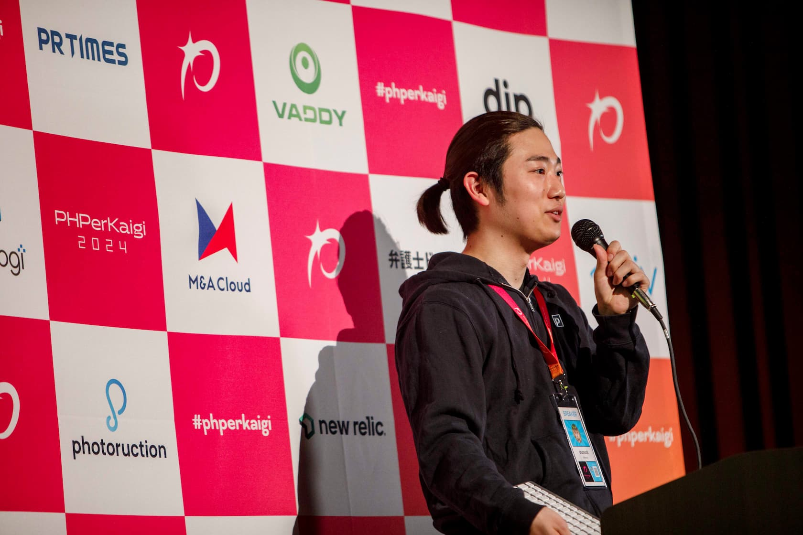

# Resume Site



This is a personal portfolio and resume site for Shunsuke Tsuchiya, built with VitePress and deployed to GitHub Pages.

## Project Overview

This site contains:
- Personal profile and self-introduction
- Resume and career history
- Showcase of work projects and open-source software
- List of presentations at conferences
- Technical and personal blog posts

You can view this resume site at:
- GitHub Pages: [https://shunsock.github.io/resume/](https://shunsock.github.io/resume/)
- GitHub: [https://github.com/shunsock/resume/tree/master/src/docs](https://github.com/shunsock/resume/tree/master/src/docs)
- Local files: Browse the content directly in the `src/docs/` directory

## Tech Stack

- [VitePress](https://vitepress.dev/) - Static site generator based on Vue
- [Bun](https://bun.sh/) - JavaScript runtime and package manager
- GitHub Actions for CI/CD
- GitHub Pages for hosting

## Development

### Prerequisites

- [Bun](https://bun.sh/) (v1.0.11 or later)

### Docker

1. Clone the repository
   ```bash
   git clone https://github.com/shunsock/resume.git
   cd resume
   ```

2. Build Project and Get in Container
   ```bash
   docker compose up -d --build
   docker compose exec vitepress bash
   ```

3. Install dependencies
   ```bash
   bun install
   ```

4. Start the development server
   ```bash
   bun run docs:dev
   ```

5. Open your browser and visit `http://localhost:5173/resume/`


## CI/CD

### CI

The `.github/workflows/build.yml` workflow is triggered when a pull request is opened against the master branch. Please note that the deployment workflow only runs if changes are made within the `src` directory.

### Deploy

The `.github/workflows/deploy.yml` workflow is triggered when changes are pushed to the master branch. Similar to the CI workflow, deployment only proceeds if there are changes detected in the `src` directory.

## Project Structure

```
resume/
├── .github/                # GitHub Actions workflows and configs
├── src/                    # Source code
│   ├── docs/               # Content files (Markdown)
│   │   ├── .vitepress/     # VitePress configuration
│   │   ├── blog/           # Blog posts
│   │   ├── profile/        # Profile information
│   │   ├── works/          # Work projects
│   │   └── index.md        # Home page
│   ├── bun.lockb           # Bun lock file
│   └── package.json        # Project dependencies and scripts
└── README.md               # This file
```

## License

[MIT](LICENSE)

